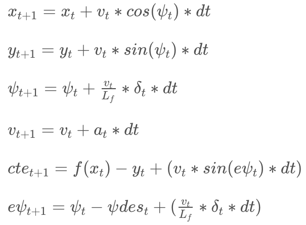

# CarND-Controls-MPC
Term2-Project3: Car control with MPC

This project aims to demonstrate car control using Model Predictive Control (MPC). The goal is to ensure the car drives at least one loop around the simulator circuit without leaving the driveable area. The simulator provides the waypoints, steering angle, throttle, speed and orientation. The program uses these inputs to calculate cte, predict the path and optimize it based on error costs and returns control commands to the simulator to keep the car in the middle.

## The Model

This project uses a simple Kinematic model that ignores tire forces, gravity, mass, longitudinal & lateral forces...etc to predict the cars motion. Therefore, the state of the car in this model constitutes of its x & y coordinates, orientation angle (psi), velocity (v), the cross track error (cte) and psi error (epsi). Only the acceleration and steering angle are considered as actuators, with a ranage of (-1,1) and (-25deg, 25deg) respectively. The model uses these state parameters at time t to predict the car's next state at time t+1. The following equations are used to compute the state.



where, a = car's acceleration, delta = steering angle, Lf = distance between car's center of mass and front wheels. The goals is the compute the optimal acceleration (a) and the steering angle (psi) that minimizes the cost, which is based of cte & epsi.

## Timestep Length and Elapsed Duration (N & dt)

N and dt determine the number of steps/point calculated in MPC. Large values of N means we're trying to predict the state after a long time based on our current state. However, this provides erroneous results as the state changes at every time interval and the state predicted so far off in time may be completely wrong than the actual state that might be reached at that time. To evaluate this, when I set N=100 and dt=1, we can clearly see a much longer curve in the simulator, but of bad values. Reducing to a range 50 and eventually to ~10 (suggested from udacity resources) seemed to help. However, dt=1 seemed to be a large time step, as there weren't enough number of points to get a meaningful curve (i.e, cost reduction was bad). Naviely reducing it bya factor of 10, dt=0.1 resulted in the car slowing down or eventually stopping in the simulator. This is possiblly due to the large number of calculation that needed to be done at each step. So N=100 and dt=0.1 seemed to be keep the car in track, but extremely slow. So eventually N=10 and dt=0.1 (as suggested by Udacity resources) seemed to provide the best results. Even slighter changes from these values, resulted in considerable difference in performace in the simulator. The video captures these observations at different values. [https://youtu.be/2I4J8_7BPu0](https://youtu.be/2I4J8_7BPu0)

## Polynomial Fitting and MPC Preprocessing

The waypoints from the simulator are first transformed into car's co-ordinate space using standard trignometric transormations. A 3rd degree polynomial is fitted to these points using the provided _polyfit_ method. The resulting coefficients are then used to compute cte & epsi.

## Model Predective Control with Latency

To over come the delays/latency, instead of using the intial state as is, a new state is calculated using the model and the measured delay. Lines 130 to 137 in ./src/main.cpp shows this calculation. This new state is then fed to the pipeline and the delay is thus compensated.

---

## Dependencies

* cmake >= 3.5
 * All OSes: [click here for installation instructions](https://cmake.org/install/)
* make >= 4.1(mac, linux), 3.81(Windows)
  * Linux: make is installed by default on most Linux distros
  * Mac: [install Xcode command line tools to get make](https://developer.apple.com/xcode/features/)
  * Windows: [Click here for installation instructions](http://gnuwin32.sourceforge.net/packages/make.htm)
* gcc/g++ >= 5.4
  * Linux: gcc / g++ is installed by default on most Linux distros
  * Mac: same deal as make - [install Xcode command line tools]((https://developer.apple.com/xcode/features/)
  * Windows: recommend using [MinGW](http://www.mingw.org/)
* [uWebSockets](https://github.com/uWebSockets/uWebSockets)
  * Run either `install-mac.sh` or `install-ubuntu.sh`.
  * If you install from source, checkout to commit `e94b6e1`, i.e.
    ```
    git clone https://github.com/uWebSockets/uWebSockets
    cd uWebSockets
    git checkout e94b6e1
    ```
    Some function signatures have changed in v0.14.x. See [this PR](https://github.com/udacity/CarND-MPC-Project/pull/3) for more details.

* **Ipopt and CppAD:** Please refer to [this document](https://github.com/udacity/CarND-MPC-Project/blob/master/install_Ipopt_CppAD.md) for installation instructions.
* [Eigen](http://eigen.tuxfamily.org/index.php?title=Main_Page). This is already part of the repo so you shouldn't have to worry about it.
* Simulator. You can download these from the [releases tab](https://github.com/udacity/self-driving-car-sim/releases).
* Not a dependency but read the [DATA.md](./DATA.md) for a description of the data sent back from the simulator.


## Basic Build Instructions

1. Clone this repo.
2. Make a build directory: `mkdir build && cd build`
3. Compile: `cmake .. && make`
4. Run it: `./mpc`.
